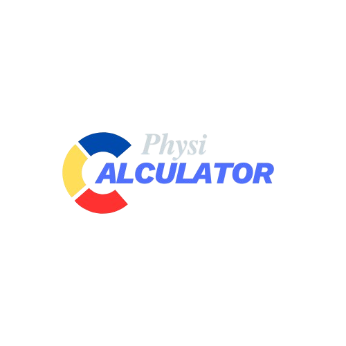
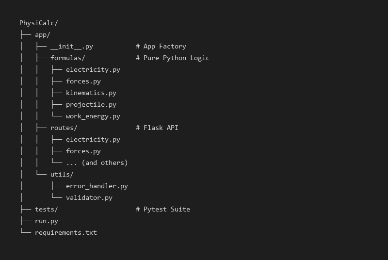

<div align="center">
  

  <h1>PhysiCalc API</h1>
  <p><strong>A Modular Physics Computation API built with Flask</strong></p>

  <p>
    
    
    
    
    
    
  </p>
</div>

---

## 🚀 Overview

PhysiCalc is a **physics engine API** built using Flask and designed for:

- Educational tools  
- Physics calculators  
- Simulation backends  
- Mobile/desktop apps needing physics computation  

It provides modular calculation engines for:

- Kinematics  
- Projectile Motion  
- Work & Energy  
- Electricity  
- Forces  

All formulas are isolated inside `app/formulas/`, while API endpoints live inside `app/routes/`.

---

## 📂 Project Structure

Below is the auto-generated visual file structure:

<div align="center">
  
</div>

---

## 🛠 Installation & Setup

Here’s the installation guide image generated using your Pillow script:

<div align="center">
  
</div>

### Install dependencies

```bash
pip install -r requirements.txt
````

Requirements include:

```
Flask==3.0.0
flask-cors==4.0.0
gunicorn==21.2.0
pytest==8.0.0
flasgger==0.9.7.1
Pillow
```

---

## 📡 API Usage Example

This is the example request/response for kinematics (velocity):

<div align="center">  </div>

---

## 📘 API Documentation (Swagger / Flasgger)

PhysiCalc includes automatic API documentation via Flasgger.

Live docs:
👉 [https://physicalc.onrender.com/apidocs/](https://physicalc.onrender.com/apidocs/)

Features:

* Auto-generated Swagger UI
* Test endpoints directly
* Faster frontend/mobile integration

---

## 🧠 Modules Included

### ⚡ Electricity

* Ohm’s Law (V, I, R)
* Power equations
* Auto-handles division-by-zero

### 🏎️ Kinematics

* Full SUVAT equations
* Velocity, displacement, acceleration, time
* Proper input validation

### 🏹 Projectile Motion

* Range
* Time of flight
* Maximum height
* Angle → radians conversion handled internally

### 🔋 Work & Energy

* Kinetic & Potential energy
* Work
* Power

### 🍎 Forces

* Net force
* Weight (gravity)
* Friction
* Normal force

---

## 🧪 Testing

Unit tests are located in `/tests/`.

Run tests:

```bash
pytest
```

---

## 🌍 Deployment (Render)

Build Command:

```bash
pip install -r requirements.txt
```

Start Command:

```bash
gunicorn run:app
```

Live deployment:
👉 [https://physicalc.onrender.com/apidocs/#](https://physicalc.onrender.com/apidocs/#)

---

## 📜 License

MIT License — free to use, modify, and distribute.

---

## 👨‍💻 Author

Made by Mhar with ❤️ and Python.

```
```
